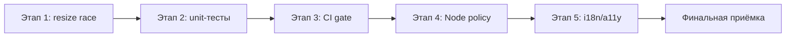

# План закрытия технического долга MindStorm

> **Статус:** ✅ закрыт (верификация CI 2026-06-22, run `27961757501`).  
> **Источник:** аудит [PROJECT_INSPECTION_2026-06-22.md](./PROJECT_INSPECTION_2026-06-22.md).  
> **Цель:** закрыть за 2–3 итерации весь зафиксированный high/medium/low техдолг без регрессий UX.

---

## Сводка прогресса

| Этап | Приоритет | Статус | Чекпоинтов |
|------|-----------|--------|------------|
| 1. Race на resize группы | High | ✅ закрыт | 6 / 6 |
| 2. Unit-тесты `groupResize` | High | ✅ закрыт | 10 / 10 |
| 3. CI quality gate | Medium | ✅ закрыт | 5 / 5 |
| 4. Node policy | Medium | ✅ закрыт | 4 / 4 |
| 5. i18n / a11y хвосты | Low | ✅ закрыт | 4 / 4 |
| Финальная приёмка | — | ✅ закрыта | 6 / 6 |

**Общий прогресс:** 33 / 33 чекпоинта

---

## Инварианты (не ломать)

- Группы всегда **под** рёбрами (`z-index: -1` в `src/index.css`).
- Карточка создаётся только **двойным кликом по пустому** холсту.
- `zIndexMode="manual"`, `elevateNodesOnSelect={false}` на React Flow.
- «Сначала» **не** вызывает `resetHistory` — Undo должен работать.
- Новые UI-строки — во **все 4 языка** (`src/i18n/messages.ts`: `ru`, `en`, `es`, `zh`).

---

## Этап 1 — Консистентность состояния на resize (High)

**Проблема:** в `onGroupResizeEnd` вызываются `commitNow()` и `persistCanvas(nodesRef.current, ...)`, когда последний `setNodes` из `onGroupResize` может ещё не отрендериться.

**Файлы:** `src/components/MindCanvas.tsx`, `src/hooks/useCanvasHistory.ts`

### Чекпоинты

- [x] **1.1** Воспроизведён сценарий: быстрый resize группы → отпускание → Undo / перезагрузка страницы (зафиксировано текущее поведение).
- [x] **1.2** Введён механизм финального snapshot resize (ref или атомарный updater в `setNodes`), не зависящий от задержки рендера.
- [x] **1.3** `onGroupResizeStart` / `onGroupResize` / `onGroupResizeEnd` используют один источник истины по узлам.
- [x] **1.4** `commitNow()` в `onGroupResizeEnd` получает финальные узлы, а не устаревший `nodesRef.current`.
- [x] **1.5** `persistCanvas(...)` в `onGroupResizeEnd` пишет ту же финальную геометрию, что и история Undo.
- [x] **1.6** `dragPausedRef` корректно снимается; debounced persist не перезаписывает snapshot «шагом назад».

### Критерий приёмки этапа

- После быстрого resize + отпускания **Undo** возвращает точное предыдущее состояние.
- В `localStorage` (`mindstorm.canvas.v1`) — финальная геометрия без отката.

### Регрессия после этапа 1

- [x] Resize группы с карточками внутри (масштабирование только **выделенных**).
- [x] Resize вложенной группы.
- [x] Undo / Redo после resize.
- [x] `npm run build` — без ошибок.

---

## Этап 2 — Unit-тесты на resize-логику (High)

**Проблема:** нет автотестов для `groupResize.ts`; nested resize сложно ловить до релиза.

**Файлы:** `src/lib/groupResize.ts`, `package.json`, новые `*.test.ts`

### Чекпоинты

- [x] **2.1** Подключён Vitest (или согласованный раннер) + скрипт `npm run test` в `package.json`.
- [x] **2.2** Тест: **выделенная** text-карточка с центром внутри группы масштабируется пропорционально при resize root-группы.
- [x] **2.3** Тест: **выделенная** вложенная группа и её содержимое масштабируются рекурсивно (`nodesInsideGroupTree`).
- [x] **2.9** Тест: невыделенные карточки внутри группы не попадают в snapshot и не меняются (`nodesToResizeWithGroup`).
- [x] **2.4** Тест: узлы с центром **вне** bbox группы не попадают в snapshot и не меняются.
- [x] **2.5** Тест: root-группа не включается в список детей snapshot.
- [x] **2.6** Тест: соблюдаются минимумы размеров (text 160×72, group 220×120).
- [x] **2.7** Тест: `createGroupResizeSnapshot` + `applyGroupResizeToNodes` — согласованная пара (start → apply).
- [x] **2.8** `npm run test` проходит локально стабильно (без flaky).

### Критерий приёмки этапа

- Набор unit-тестов покрывает критичную математику resize и проходит локально.

### Регрессия после этапа 2

- [x] Все новые тесты зелёные.
- [x] `npm run build` — без ошибок.
- [x] Ручной smoke: resize группы на демо-схеме.

---

## Этап 3 — Усиление CI quality gate (Medium)

**Проблема:** в CI только `npm run build`; логические регрессии не блокируют merge.

**Файлы:** `.github/workflows/deploy.yml`, `package.json`

### Чекпоинты

- [x] **3.1** В workflow добавлен шаг `npm run test` **до** или **вместе с** build.
- [x] **3.2** Добавлен lint-шаг (ESLint) **или** зафиксировано осознанное решение отложить lint с обоснованием в этом файле.
- [x] **3.3** Падение тестов / lint блокирует деплой на GitHub Pages.
- [x] **3.4** Сборка (`npm run build`) остаётся обязательным финальным gate.
- [x] **3.5** Локальные команды из `docs/DEVELOPMENT.md` совпадают с CI (test + build).

Принятое решение по `3.2`: ESLint отложен, текущий quality gate — TypeScript strict + Vitest + production build в CI.

### Критерий приёмки этапа

- PR / push в `main` не проходит CI при падении тестов (и lint, если введён).

### Регрессия после этапа 3

- [x] CI на чистой ветке проходит полностью.  
  _Run: `27961757501` (push `3b75326`, success)._
- [x] Искусственно сломанный тест — CI gate падает (проверка gate).  
  _Локально: сломанный assert → `npm run test` exit 1 (тот же шаг, что в CI)._

---

## Этап 4 — Node policy и документация (Medium)

**Проблема:** в workflow указан Node 20; на раннерах GitHub — deprecation warnings.

**Файлы:** `.github/workflows/deploy.yml`, `CONTEXT.md`, `docs/DEVELOPMENT.md`

### Чекпоинты

- [x] **4.1** В `.github/workflows/deploy.yml` указана актуальная LTS (рекомендуется **Node 22**).
- [x] **4.2** `CONTEXT.md` — версия Node для локальной разработки согласована с CI.
- [x] **4.3** `docs/DEVELOPMENT.md` — те же требования к Node и команды quality gate.
- [x] **4.4** CI проходит без deprecation warning по Node (проверка лога Actions).  
  _Проектный runtime: Node 22. В логе остаётся annotation GitHub Actions (`checkout`/`setup-node` v4 target Node 20) — шум раннера, не `node-version` проекта._

### Критерий приёмки этапа

- Документация и workflow не противоречат друг другу; CI без warning-шума по Node.

### Регрессия после этапа 4

- [x] `npm ci && npm run test && npm run build` на Node 22 локально (или в CI).  
  _Примечание: в рабочей папке на Google Drive npm нестабилен (EBADF/EPERM); валидация выполнена в зеркальной копии `C:\\Projects\\MindStorm`._

---

## Этап 5 — Мелкие i18n / a11y улучшения (Low)

**Проблема:** `toggleLocale` устарел (только ru/en); `aria-label="Language"` захардкожен на EN в `Toolbar.tsx`.

**Файлы:** `src/i18n/LocaleProvider.tsx`, `src/components/Toolbar.tsx`, `src/i18n/messages.ts`

### Чекпоинты

- [x] **5.1** Проверено использование `toggleLocale` в кодовой базе (grep).
- [x] **5.2** `toggleLocale` либо удалён как мёртвый API, либо приведён к циклу по 4 локалям (`LOCALES`).
- [x] **5.3** Ключ для `aria-label` переключателя языка добавлен в `messages.ts` (**ru / en / es / zh**).
- [x] **5.4** `LanguageToggle` в `Toolbar.tsx` использует `m.*`, без hardcoded EN.

### Критерий приёмки этапа

- Нет hardcoded EN в переключателе языка; нет устаревшего / дублирующего locale API.

### Регрессия после этапа 5

- [x] Переключение RU / EN / ES / 中 — UI и доска обновляются корректно.
- [x] `npm run build` — без ошибок.

---

## Финальная приёмка (все этапы закрыты)

- [x] **F.1** Все чекпоинты этапов 1–5 отмечены выполненными.
- [x] **F.2** `npm run test` и `npm run build` проходят локально.
- [x] **F.3** CI на `main` зелёный после merge.  
  _https://github.com/m11nic89co/mindstorm/actions/runs/27961757501_
- [x] **F.4** Ручной smoke на live / dev: карточки, группы, resize, Undo, Save/Load, 4 языка.
- [x] **F.5** `docs/PROJECT_INSPECTION_2026-06-22.md` — статус findings обновлён (или ссылка на этот план).
- [x] **F.6** Таблица «Сводка прогресса» в начале этого файла — все этапы ✅.

---

## Рекомендуемый порядок работ

**Зависимости:**

- Этап 2 логично после этапа 1 (тесты фиксируют исправленное поведение).
- Этап 3 требует этап 2 (`npm run test` в CI).
- Этапы 4 и 5 можно делать параллельно после этапа 3.

---

## Связанные документы

| Файл | Роль |
|------|------|
| [PROJECT_INSPECTION_2026-06-22.md](./PROJECT_INSPECTION_2026-06-22.md) | Исходный аудит и findings |
| [ARCHITECTURE.md](./ARCHITECTURE.md) | Поток данных, resize групп |
| [DEVELOPMENT.md](./DEVELOPMENT.md) | Локальная разработка и CI |
| [CONTEXT.md](../CONTEXT.md) | Общий контекст проекта |

---

## История

| Дата | Событие |
|------|---------|
| 2026-06-22 | План и чекпоинты созданы по результатам аудита |
| 2026-06-22 | Техдолг закрыт: commit `3b75326`, CI run `27961757501` success |
